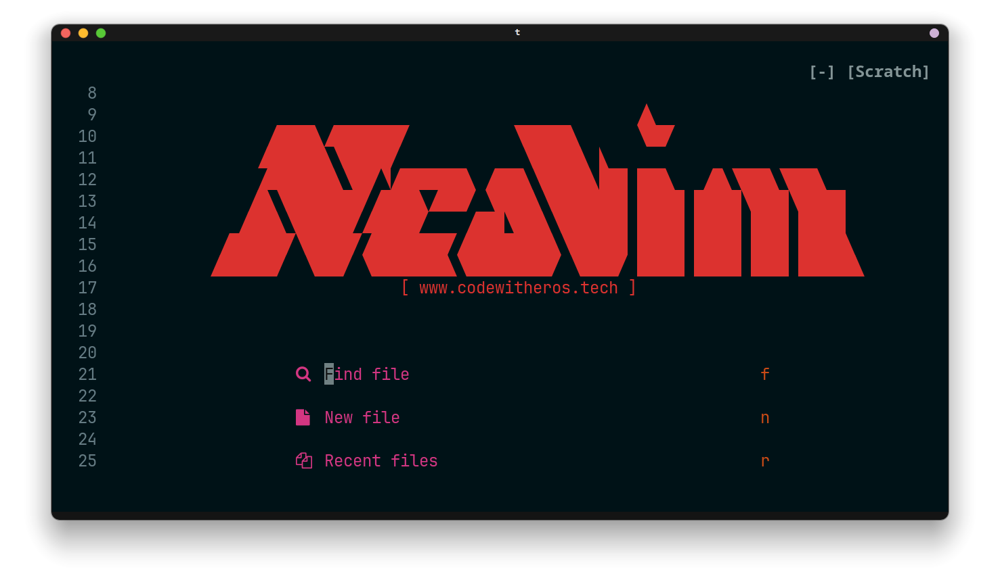

# 💤 Neovim config (LazyVim)



A [LazyVim](https://github.com/LazyVim/LazyVim)-based Neovim configuration.
The layout matches the current LazyVim starter exactly (`lua/config/` +
`lua/plugins/`), so there is nothing to merge when upstream changes — LazyVim
is just a plugin, updated in place.

## Requirements

- Neovim >= 0.11.2 (LazyVim v16)
- `git` (lazy.nvim bootstrap and plugin management)
- Kitty filetype support ships in-repo (`ftdetect/`, `ftplugin/`, `syntax/`)

## Getting started

1. Back up any existing config, then deploy this repo as your config:

   ```bash
   mv ~/.config/nvim{,.bak}
   # optional but recommended
   mv ~/.local/share/nvim{,.bak}
   mv ~/.local/state/nvim{,.bak}
   mv ~/.cache/nvim{,.bak}

   git clone <this-repo> ~/.config/nvim   # or symlink the nvim/ dir from Dotfiles
   ```

2. First launch bootstraps lazy.nvim, installs all plugins, and runs
   `:Lazy health` checks. Then:

   - `:Lazy` — plugin manager (status / install / update)
   - `:Lazy health` — verify the setup
   - `:Mason` — language servers / formatters / linters

## Project structure

- `init.lua` — entry point: bootstraps LazyVim, sets the active colorscheme
  (NeoSolarized; commented alternatives: catppuccin-mocha, kanagawa)
- `lua/config/lazy.lua` — lazy.nvim setup: imports LazyVim, the
  `mini-animate` extra, and your `lua/plugins/` specs. Pins the plugin
  lockfile to this repo (`lazy-lock.json`)
- `lua/config/options.lua` — Neovim options (winbar)
- `lua/config/keymaps.lua` — custom keymaps
- `lua/config/autocmds.lua` — custom autocommands + line-number options
- `lua/plugins/` — per-plugin specs:
  - `NeoSolarized.lua`, `catppuccin.lua`, `Kanagawa.lua` — the three kept
    colorschemes (see `init.lua` to switch)
  - `noice.lua` — disables noice/nvim-notify notifications
  - `codeium.lua` — Codeium AI completions (`<C-a>`, `<C-g>`, `<M-a>`, `<M-g>`, `<M-x>`)
  - `copilot.lua` — GitHub Copilot (`:Copilot`)
  - `tailwindcss.lua` — tailwindcss LSP + colorizer
  - `Haproxy.lua` — HAProxy syntax highlighting
- `ftdetect/`, `ftplugin/`, `syntax/` — kitty terminal filetype support
  (independent of LazyVim, keep as-is)

## Updating (merge-free)

LazyVim is not vendored here — it is a plugin. The starter layout this config
mirrors is frozen upstream, so updating is a single command, a few times a
year:

```vim
:Lazy update
```

Then, for anything that changed:

- skim the LazyVim release notes / `:Lazy news` for breaking changes,
- run `:checkhealth` to confirm nothing regressed (especially after Neovim
  or LazyVim minor releases).

`lazy-lock.json` pins every plugin's exact commit. It is kept **in this repo**
(lazy.nvim's default is the data dir; the `lockfile` option in
`lua/config/lazy.lua` points it at the config). After an update, commit the
updated lockfile so reinstalls are reproducible.

## Safety net: upstream LazyVim starter

Nothing in this repo forks or patches LazyVim internals; the LazyVim plugin
itself always tracks upstream `main` via `:Lazy update`. The upstream starter
([LazyVim/starter](https://github.com/LazyVim/starter)) is intentionally **not**
configured as a git remote — if you ever want to diff against it:

```bash
git remote add starter https://github.com/LazyVim/starter
git fetch starter
git diff starter/main -- nvim/
```

## Notes

- `lazyvim.json` is auto-generated LazyVim state (extras list) — do not
  hand-edit; it is gitignored.
- Neovim >= 0.11 enables truecolor by default; no `termguicolors` shims needed.
